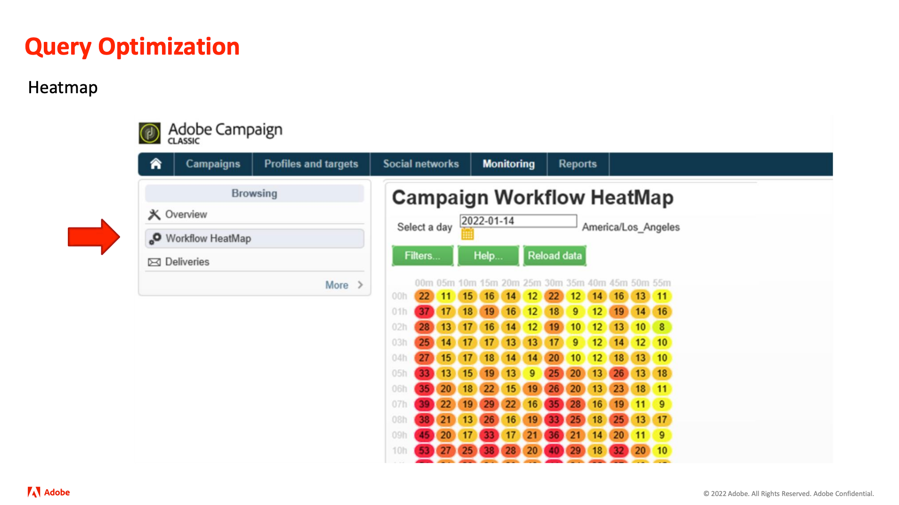

# Adobe Campaign內幕

為Adobe Campaign客戶提供的技巧和靈感，幫助他們發展跨渠道營銷策略，提高團隊營銷從業者技能，並幫助組織推出更先進的跨渠道營銷策略。

>[!TIP]
>
>**所有錄制的會話都列在左側的導航中**。

## 特色

<table>
  <tr>
   <td>
      
      

         <a href="./2022/cross-channel.md"><strong>使用 Adobe Campaign Classic 提升您的跨管道行銷</strong></a>
          
      

   </td>
   <td>
      
      

         <a href="./2022/integrations.md"><strong>Adobe Campaign 與行銷生態系統的整合</strong></a>
          
      

   </td>
   <td>
      
      

         <a href="2022/tips.md"><strong>從專業人員節省時間的提示</strong></a>
          
      

   </td>
</table>