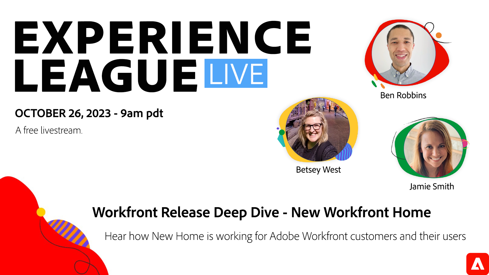

# Workfront版本深入探討 — 全新Workfront首頁

聽取Workfront客戶介紹New Home如何為他們及其使用者運作。 瞭解8月推出的新首頁功能以及我們新的管理員配置控制。 並瞭解2024年Home的未來發展。

Workfront首頁經過全面改版，現已成為生產力的動力來源。 透過其可自訂的Widget，您可以簡化工作流程，順暢地周遊於專案、任務、問題、請求和提及中，確保一切順利進行。 靈活地調整首頁以符合您的獨特需求，讓您能夠建立自己的集中式Workfront中樞。

在這場Experience League即時座談中，產品專家Ben Robbins將逐步引導您瞭解新的首頁體驗，包括新的管理員配置控制和令人興奮的2024年增強功能。 Workfront客戶Jamie Smith將會分享新的家庭體驗如何提高AT&amp;T的生產力。

此即時會議一如既往地可讓您在聊天中提問並取得專家的解答。

**按一下上方影像以設定提醒！**
