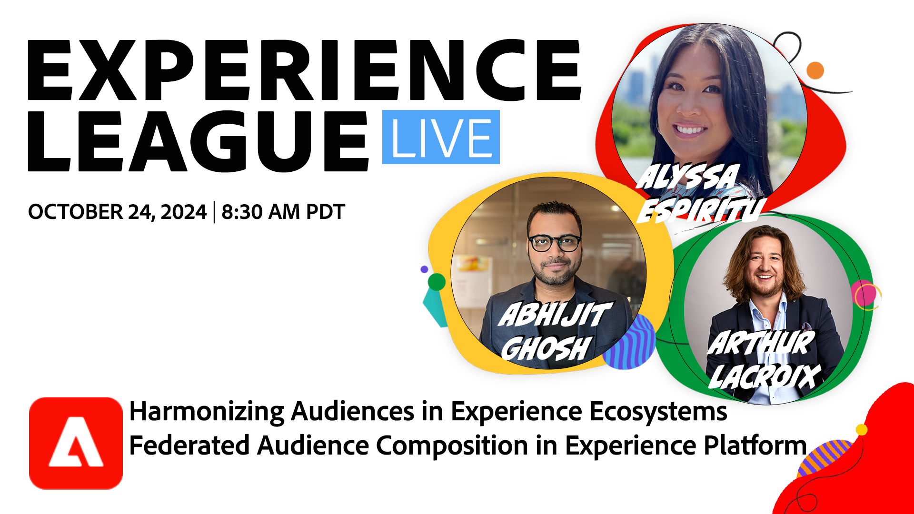

# 協調體驗生態系統中的受眾 — Experience Platform中的同盟受眾組成

瞭解同盟受眾構成如何透過Real-Time CDP和Journey Optimizer提供全方位受眾組織與啟用方法。

[註冊此活動](https://engage.adobe.com/ExpLeagueLive-241024.html)

**顯示詳細資料**：
取得對企業資料倉儲的擴充存取權，以組成對象並強化品牌啟動和即時的體驗。

在本次研討會中，您將學習如何：

* 無需複製基礎資料即可存取重要的倉儲型資料集，將重複專案減至最少。
* 使用以倉儲為基礎的資料集來撰寫及豐富高價值對象。
* 跨多個管道啟用這些對象，以支援低延遲使用案例並強化個人化體驗。
