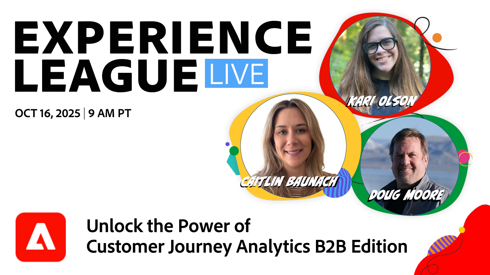
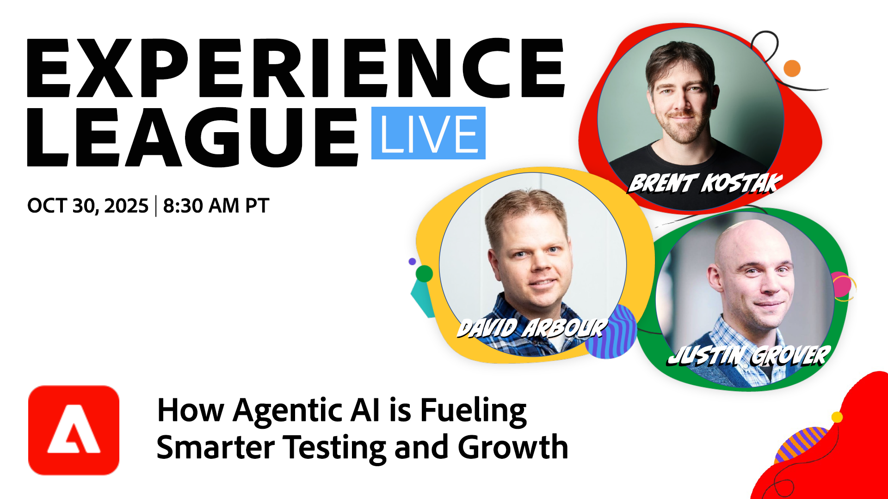

# Experience League LIVE

Experience League LIVE是Experience League團隊製作的直播串流節目。  您可以藉此機會與 Adobe 產品專家交流，並學到您可以透過 Adobe Experience Cloud 應用程式套用的可落實秘訣、技巧和策略。

## 即將推出的Experience League LIVE活動

<table>
    <tr>
        <td style="vertical-align: top;">
            

              <a href="episodes/exl-live-episode-10-16-25.md">
                <strong>解鎖Customer Journey Analytics B2B edition的強大功能</strong>
              </a>
               <em>與Doug Moore、Kari Olson、Caitlin Baunach</em>
               <em>2025年10月16日</em>
            

        </td>
        <td style="vertical-align: top;">
            

              <a href="episodes/exl-live-episode-10-22-25.md">
                使用Adobe Experience Platform Agent Orchestrator <strong>新一代客戶體驗與效率</strong>
              </a>
               <em>與Daniel Wright、Namita Krishnan和Huong Vu</em>
               <em>2025年10月22日</em>
            

        </td>
         <td style="vertical-align: top;">
            

              <a href="episodes/exl-live-episode-10-30-25.md">
                <strong>下一個實驗時代：Agentic AI如何推動更聰明的測試和成長</strong>
              </a>
               <em>與Sandra Hausmann、Brent Kostak、Justin Grover和David Arbor</em>
               <em>2025年10月30日</em>
            

        </td>
    </tr>

</table>

## 員工精選

<table style="max-width: 1214px;">

<tr>
  <td style="vertical-align: top;">
    

      <a href="episodes/exl-live-episode-06-26-24.md">
        <strong>最新的Adobe Real-Time CDP發行版本如何推動您的業務發展</strong>
      </a>
       <em>與Nina Caruso、Rudi Shumpert和Doug Moore</em>
       <em>2024年6月26日</em>
    

  </td>

<td style="vertical-align: top;">
    
    

      <a href="episodes/exl-live-episode-05-16-24.md"><strong>這是將Analytics移轉至Web SDK的方式</strong></a>
       <em>與Mitch Rice、Joe Khoury和Doug Moore</em>
       <em>2024年5月16日</em>
    

  </td>

<td style="vertical-align: top;">
    
    

      <a href="episodes/exl-live-episode-04-24-24.md">
        <strong>在Journey Optimizer中新增程式碼型體驗管道</strong>
      </a>
       <em>與Sandra Hausmann、Robert Calangiu和Brent Kostak</em>
       <em>2024年4月24日</em>
    

  </td>
  </tr>

</table>

>[!TIP]
>
>如需其他學習方法，請檢視我們的免費[課程](https://experienceleague.adobe.com/zh-hant#dashboard/learning)以及個別[教學課程](https://experienceleague.adobe.com/docs/home-tutorials.html?lang=zh-Hant)。

