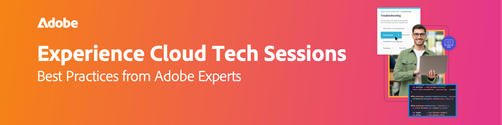

# Experience Cloud技術課程錄影

{align="center"}

透過即時和隨選技術研討會，充分發揮Adobe Experience Cloud的潛力。 這些網路研討會經過精心設計，超越了傳統支援的範疇。 這些會議由經驗豐富的Adobe專家帶領，提供寶貴的秘訣、技巧和策略，協助您滿懷信心地瀏覽技術解決方案，避免常見陷阱。 Adobe專家是技術支援工程師，負責處理熱門問題，並積極處理日常案例。 即時和隨選選項可讓您隨時彈性存取資訊，確保順暢的學習體驗。

## 2024年工作階段

<!-- CARDS
{cta = Watch}

* 2024/aep-web-sdk-troubleshooting.md
* 2024/ai-assistant.md
* 2024/champion-office-hours.md
* 2024/rtcdp-timings.md
* 2024/tracking-visitors.md

-->
<!-- START CARDS HTML - DO NOT MODIFY BY HAND -->

    

        

            

                <figure class="image x-is-16by9">
                    
                </figure>
            

            

                

                    

                        <a href="2024/aep-web-sdk-troubleshooting.md" target="_blank" rel="referrer" title="AEP Web SDK疑難排解、Assurance以及秘訣與技巧">AEP Web SDK疑難排解、Assurance和秘訣與技巧</a>
                    

                    
與Garrett Hartley一起參加有關AEP Web SDK工作流程疑難排解的全面會議，集中於RTCDP、Adobe Analytics的資料收集，以及解決常見的實施挑戰。

                

                <a href="2024/aep-web-sdk-troubleshooting.md" target="_blank" rel="referrer" class="spectrum-Button spectrum-Button--outline spectrum-Button--primary spectrum-Button--sizeM" style="align-self: flex-start; margin-top: 1rem;">
                    觀看
                </a>
            

        

    

    

        

            

                <figure class="image x-is-16by9">
                    
                </figure>
            

            

                

                    

                        <a href="2024/ai-assistant.md" target="_blank" rel="referrer" title="使用Adobe Experience Platform中的AI助理快速啟動您的生產力">在Adobe Experience Platform中使用AI助理快速啟動您的生產力</a>
                    

                    
加入Rachel Hanessian和Ariel Sultan的深入網路研討會，瞭解如何透過AI Assistant設定、開始使用及探索使用案例，以提高Real-Time CDP、Journey Optimizer和Customer Journey Analytics的生產力。

                

                <a href="2024/ai-assistant.md" target="_blank" rel="referrer" class="spectrum-Button spectrum-Button--outline spectrum-Button--primary spectrum-Button--sizeM" style="align-self: flex-start; margin-top: 1rem;">
                    觀看
                </a>
            

        

    

    

        

            

                <figure class="image x-is-16by9">
                    
                </figure>
            

            

                

                    

                        <a href="2024/champion-office-hours.md" target="_blank" rel="referrer" title="Marketo Engage冠軍技術研討會 — 2024年5月">Marketo Engage冠軍技術研討會 — 2024年5月</a>
                    

                    
參加我們五月Marketo Champion技術研討會，我們的Champion小組成員包括Chris Kelley、Sarah Ryan、Jimmy Spencer和Briney Young，主持人為Courtny Edwards-Jones。無論您是第一次使用Marketo，還是隻想提升您的技能，我們的冠軍將分享他們的專業知識。

                

                <a href="2024/champion-office-hours.md" target="_blank" rel="referrer" class="spectrum-Button spectrum-Button--outline spectrum-Button--primary spectrum-Button--sizeM" style="align-self: flex-start; margin-top: 1rem;">
                    觀看
                </a>
            

        

    

    

        

            

                <figure class="image x-is-16by9">
                    
                </figure>
            

            

                

                    

                        <a href="2024/rtcdp-timings.md" target="_blank" rel="referrer" title="即時內容資料平台時間表和預期情況">即時內容資料平台時間表和預期狀況</a>
                    

                    
與Adobe全球主管Seth Burke一起舉辦極具洞察力的網路研討會，探討導覽Real-Time Content Data Platform (RTCDP)的最佳實務。 Seth會引導您瞭解資料擷取、對象評估和匯出時間的複雜過程，並強調每個階段的主要限制。

                

                <a href="2024/rtcdp-timings.md" target="_blank" rel="referrer" class="spectrum-Button spectrum-Button--outline spectrum-Button--primary spectrum-Button--sizeM" style="align-self: flex-start; margin-top: 1rem;">
                    觀看
                </a>
            

        

    

    

        

            

                <figure class="image x-is-16by9">
                    
                </figure>
            

            

                

                    

                        <a href="2024/tracking-visitors.md" target="_blank" rel="referrer" title="追蹤Cookie、瀏覽器和程式庫不斷變化的環境中的訪客">在不斷變化的Cookie、瀏覽器和資料庫環境中追蹤訪客</a>
                    

                    
加入我們，參加資訊豐富的網路研討會，其中Garrett Hartley是Adobe客戶體驗團隊的資深技術支援工程師。 在這場會議中，Garrett將會分享在當今不斷演變的Cookie、瀏覽器和資料庫格局中追蹤訪客的最佳實務。我們將檢閱先前的實施策略，並探索採用現代訪客追蹤方法的有效移轉路徑。 期待破除過時的神話，瞭解改進追蹤系統的尖端方法。

                

                <a href="2024/tracking-visitors.md" target="_blank" rel="referrer" class="spectrum-Button spectrum-Button--outline spectrum-Button--primary spectrum-Button--sizeM" style="align-self: flex-start; margin-top: 1rem;">
                    觀看
                </a>
            

        

    

<!-- END CARDS HTML - DO NOT MODIFY BY HAND -->